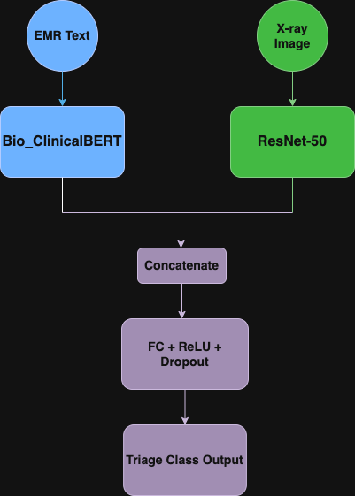

# 🏥 MediLLM: AI-Powered Clinical Triage Assistant

🚀 A multimodal LLM-based system that predicts clinical triage levels from EMRs and chest X-rays.

## 📊 Demo

## 🔧 Features

- LLM + Vision Fusion
- Few-shot Prompt Tuning
- Real-time Inference via FastAPI
- Deployed with Docker

## 🧠 Model Architecture

This project uses a fusion of:

- 🧬 ClinicalBERT for EMR text
- 🩻 ResNet-50 for chest X-rays
- ➕ Concatenated deatures passed into a classification head

## 📁 Dataset Sources

- This project uses a subset of the [COVID-19 Radiography Dataset](https://www.kaggle.com/datasets/tawsifurrahman/covid19-radiography-database)

## 📊 Sample EMR Records

- This project generates synthetic EMR records linked to chest X-ray images.

- A sample CSV file (`sample_emr_records.csv`) is provided for demonstration purposes:

📂 [`sample_data/emr_records.csv`](sample_data/sample_emr_records.csv)

| patient_id        | image_path                                   | emr_text                                                                                                     | triage_level |
| ----------------- | -------------------------------------------- | ------------------------------------------------------------------------------------------------------------ | ------------ |
| COVID-1           | images/COVID/COVID-1.png                     | Progressive difficulty in breathing. Oxygen saturation is below the normal range                             | high         |
| NORMAL-1          | images/NORMAL/Normal-1.png                   | Routine checkup with no abnormal findings. The patient denies cough or chest pain                            | low          |
| VIRAL PNEUMONIA-1 | images/VIRAL PNEUMONIA/Viral Pneumonia-1.png | Crackles are auscultated in the lower lobes. The patient presents with fatigue and mild respiratory distress | medium       |

> This sample includes 3-5 rows per class. To generate the full dataset, run `generate_emr_csv.py`.

## 📈 Dataset Notes

- This project uses synthetic EMR records aligned with publicly available chest X-ray images. EMR notes were generated using medically-inspired templates, mapped to classes (e.g., COVID -> high triage level).

> ⚠️ Note: This is **simulated data** and is for **educational purposes only**. No patient information is used.

## 🚀 Try It Locally
