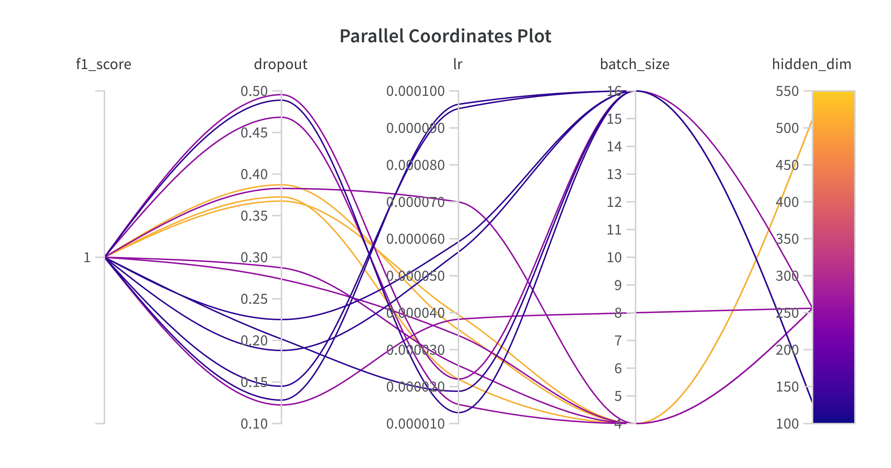
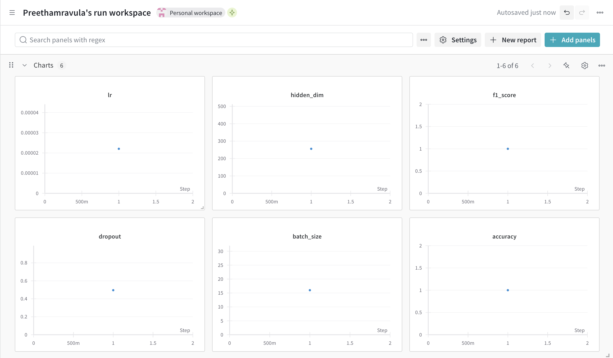
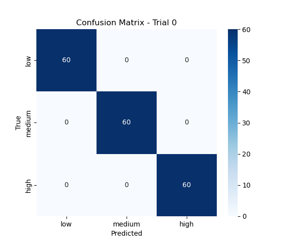

# 🩺 MediLLM: Multimodal Clinical Triage Assistant

<p align="center">
  <!-- Core tech -->
  <a href="https://www.python.org/"></a>
  <a href="https://pytorch.org/"></a>
  <a href="https://huggingface.co/docs/transformers"></a>
  <a href="https://gradio.app/"></a>

  <!-- Ops & CI -->
  <a href="https://www.docker.com/"></a>
  <a href="https://github.com/PreethamRavula/MediLLM/actions"></a>

    <!-- Docker image info -->
  <a href="https://github.com/PreethamRavula/MediLLM/pkgs/container/medi-llm">
    
  </a>
  <a href="https://github.com/PreethamRavula/MediLLM/pkgs/container/medi-llm">
    
  </a>

  <!-- Platforms -->
  <a href="<https://huggingface.co/spaces/Preetham22/medi-llm>"></a>
  <a href="<https://wandb.ai/preethamravula-n-a/MediLLM_Final_v2?nw=nwuserpreethamravula>"></a>


  <!-- Code quality / license -->
  <a href="https://github.com/psf/black"></a>
  <a href="https://choosealicense.com/licenses/mit/"></a>
</p>

> A multimodal AI system for clinical triage that fuses **Electronic Medical Records (EMR text)** with **Chest X-ray images** to predict triage level (**High / Medium / Low**).
> Includes advanced interpretability (Grad-CAM, token attention, attention rollout), automated training pipelines, CI/CD, and deployment via **Docker** & **Hugging Face Spaces**.

---

## 🚀 Demo

👉 [**Try it on Hugging Face Spaces**](https://huggingface.co/spaces/Preetham22/medi-llm)

---

## ✨ Features

- LLM + Vision Fusion
- Few-shot Prompt Tuning
- Real-time Inference via FastAPI
- Deployed with Docker

## 🧠 Model Architecture

This project uses a fusion of:

- 🧬 ClinicalBERT for EMR text
- 🩻 ResNet-50 for chest X-rays
- ➕ Concatenated deatures passed into a classification head


## 📁 Dataset Sources

- This project uses a subset of the [COVID-19 Radiography Dataset](https://www.kaggle.com/datasets/tawsifurrahman/covid19-radiography-database)

## 📊 Sample EMR Records

- This project generates synthetic EMR records linked to chest X-ray images.

- A sample CSV file (`sample_emr_records.csv`) is provided for demonstration purposes:

📂 [`sample_data/emr_records.csv`](sample_data/sample_emr_records.csv)

| patient_id        | image_path                                   | emr_text                                                                                                     | triage_level |
| ----------------- | -------------------------------------------- | ------------------------------------------------------------------------------------------------------------ | ------------ |
| COVID-1           | images/COVID/COVID-1.png                     | Progressive difficulty in breathing. Oxygen saturation is below the normal range                             | high         |
| NORMAL-1          | images/NORMAL/Normal-1.png                   | Routine checkup with no abnormal findings. The patient denies cough or chest pain                            | low          |
| VIRAL PNEUMONIA-1 | images/VIRAL PNEUMONIA/Viral Pneumonia-1.png | Crackles are auscultated in the lower lobes. The patient presents with fatigue and mild respiratory distress | medium       |

> This sample includes 3-5 rows per class. To generate the full dataset, run `generate_emr_csv.py`.

## 📈 Dataset Notes

- This project uses synthetic EMR records aligned with publicly available chest X-ray images. EMR notes were generated using medically-inspired templates, mapped to classes (e.g., COVID -> high triage level).

> ⚠️ Note: This is **simulated data** and is for **educational purposes only**. No patient information is used.

## ⚙️ Training Pipeline Overview

The MediLLM training pipeline includes the following steps:

---

1. **🧬 Synthetic Dataset Generation**

    - EMR notes are dynamically generated using class-specific medical templates, ambiguous cases, noise injection and randomized vitals with a little bit of blur.

    - Aligned with chest X-ray images (COVID, NORMAL, VIRAL PNEUMONIA).

    - Balanced dataset of 300 samples per class (900 total) via `generate_emr_csv.py`.

2. **🧪 Data Augmentation**

    - Strong augmentation applied on X-rays:
        - Random cropping, rotation, color jittering, and Gaussian blur.

    - Text inputs tokenized using ClinicalBERT tokeinizer.

3. **📦 Dataset Loader**

    - `TriageDataset.py` handles fusion of images and EMR text.

    - Includes dynamic image transformation and BERT-style tokenized text.

    - Stratified splitting via `StratifiedShuffleSplit` ensures class-balanced validation.

4. **🧠Model Architecture**

    - Text encoder: `Bio_ClinicalBERT`

    - Image encoder: Pretrained `ResNet-50`

    - Fusion: Concatenation -> Feedforward classifier -> Softmax

5. **🧪Hyperparameter Tuning**

    - `train_optuna.py` Optuna is used for automated hyperparameter search.

    - Search space includes:

        - Learning rate

        - Dropout

        - Batch size

        - Hidden dimension

    - F1 Score (weighted) is the target metric.

    - Logging and visualization powered by **Weights & Biases (W&B)**.

## 🔍 How to Run Hyperparameter Tuning

```bash
python train_optuna.py --n_trials 25
```

## 📈 Insights from Tuning & Dataset Evolution

<details>
<summary>📊<strong>Observations from Tuning Trials</strong></summary>

Despite running 15+ Optuna trials across varying combinations of:

- Learning rate
- Dropout
- Batch size
- Hidden dimensions

...the model **consistently returned a perfect F1 score (1.0)** on the synthetic dataset.

**why ?**

- Perfectly balanced classes
- Highly structured EMR templates
- Limited dataset scale (900 samples)

🔍 **Proved to be still useful:**

- Validated **robustness of the model**
- Demonstrated **disciplined experimentation** (Optuna + W&B)
- Showcased how even "easy" tasks can hide deeper challenges

> In real-world datasets, We can expect much more variation than in model behavior.
</details>

<details>
<summary>🔁<strong>Tuning Challemges & Dataset Evolution</strong></summary>

I made several iterative changes to improve dataset generalization and reduce the risk of model overfitting:

🔰 Initial Setup

- Samples: 540 Images and EMR text Total
- Result: Instant F1 = 1.0
- EMRs too clean -> model overfit quickly

🧪 Phase 1: Noise Injection

- Introduced neutral clinical sentences
- Goal was to add more confusion without changing class semantics
- Result: Model still overfit; too predictable

📈 Phase 2: Dataset Upscaling

- Scaled to 3000+ samples
- Used full COVID-19 Radiography dataset
- Result: Very long training duration; model was still overfitting

🔀 Phase 3: Realism & Ambiguity

Next I planned to add more ambiguity and realism into EMR data, perform data augmentation on X-ray Images but not very aggressive augmentation.

- ✅ Strong image augmentations (rotation, jitter, blur)
- ✅ Class-overlapping symptom phrases
- ✅ Vital blurring (e.g., SPO2: 95% in both COVID and NORMAL)
- ✅ Ambiguous mixed cues (e.g., "normal vitals, mild wheeze")
- ✅ Generic tokens (e.g., Patient-Normal-1, 45-year-old)

Result: Model performance remained high but learning was more robust

📉 Final Phase: Controlled Downscale

- Reduced the dataset to 900 samples (EMR and Images each 300/class)
- Why? Faster experimentation + forced ambiguity
- Still oserved stable performance across trials

> ⚠️ This highlights the limitations of synthetic datasets and the need to eventually test on real-world EMRs + imaging
</details>

<details>
<summary>📊<strong>W&B Visulalizations</strong></summary>

Including Following Visualizations from my hyperparameter tuning runs

- ✅ Parallel Coordinates Plot


- ✅ Best Hyperparameters run


- ✅ Best Run Confusion Matrix


</details>

## 🚀 Try It Locally

