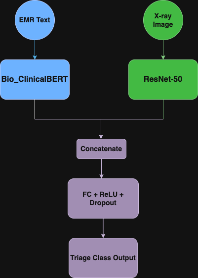
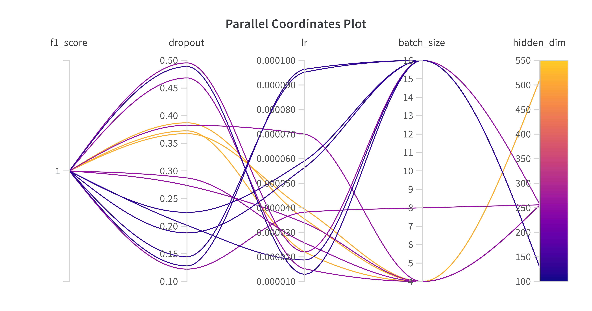
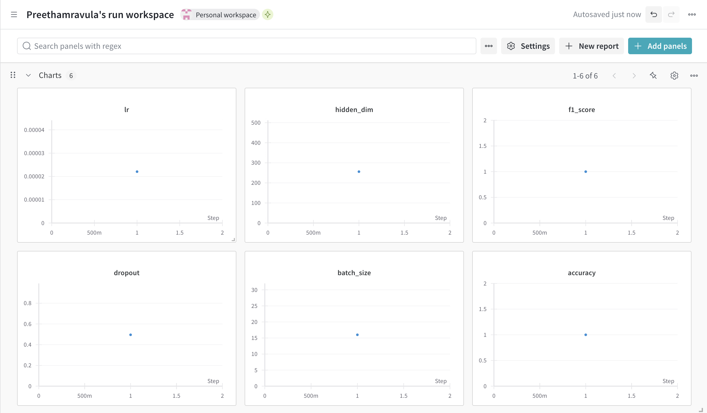
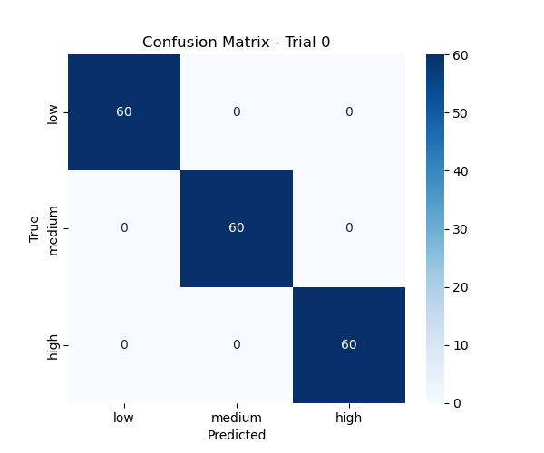

# 🩺 MediLLM: Multimodal Clinical Triage Assistant

<p align="center">
  <!-- Core tech -->
  <a href="https://www.python.org/"></a>
  <a href="https://pytorch.org/"></a>
  <a href="https://huggingface.co/docs/transformers"></a>
  <a href="https://gradio.app/"></a>

  <!-- Ops & CI -->
  <a href="https://www.docker.com/"></a>
  <a href="https://github.com/PreethamRavula/MediLLM/actions"></a>

    <!-- Docker image info -->
  <a href="https://github.com/PreethamRavula/MediLLM/pkgs/container/medi-llm">
    
  </a>
  <a href="https://github.com/PreethamRavula/MediLLM/pkgs/container/medi-llm">
    
  </a>

  <!-- Platforms -->
  <a href="<https://huggingface.co/spaces/Preetham22/medi-llm>"></a>
  <a href="<https://wandb.ai/preethamravula-n-a/MediLLM_Final_v2?nw=nwuserpreethamravula>"></a>


  <!-- Code quality / license -->
  <a href="https://github.com/psf/black"></a>
  <a href="https://choosealicense.com/licenses/mit/"></a>
</p>

> A production-ready multimodal AI system for clinical triage that fuses **Electronic Medical Records (EMR text)** with **Chest X-ray images** to predict triage level (**High / Medium / Low**).
> Built with PyTorch, Transformers, and deployed via **Docker** & **Hugging Face Spaces** with full CI/CD pipeline.

---

## 🎯 Project Highlights

**Achieved 98.3% validation F1-score** on multimodal clinical triage classification through systematic experimentation and model optimization.

### 🏆 Key Achievements

- **Multimodal Deep Learning**: Fused ClinicalBERT (text) + ResNet-50 (vision) for medical triage classification
- **Hyperparameter Optimization**: Automated search using Optuna across 15+ trials, tracked with Weights & Biases
- **Production ML Pipeline**: End-to-end pipeline from synthetic data generation → training → deployment
- **CI/CD Implementation**: GitHub Actions for automated testing, linting, and quality checks
- **Interactive Deployment**: Live demo on Hugging Face Spaces with Gradio UI and model interpretability (Grad-CAM, attention visualization)
- **Containerization**: Fully Dockerized application with docker-compose orchestration

### 📊 Model Performance

| Metric | Text-Only | Image-Only | **Multimodal** |
|--------|-----------|------------|----------------|
| **Validation Accuracy** | 96.5% | 97.2% | **98.3%** |
| **Validation F1-Score** | 0.965 | 0.972 | **0.983** |
| **Training F1-Score** | 0.965 | 0.970 | **0.965** |

*Demonstrates effective multimodal fusion and minimal overfitting through proper regularization*

---

## 🚀 Live Demo

👉 [**Try it on Hugging Face Spaces**](https://huggingface.co/spaces/Preetham22/medi-llm)

---

## 💼 Technical Skills Demonstrated

<table>
<tr>
<td>

**Machine Learning**
- PyTorch & Torchvision
- Transformers (HuggingFace)
- Transfer Learning
- Multimodal Fusion
- Hyperparameter Optimization (Optuna)

</td>
<td>

**MLOps & Engineering**
- Docker & Docker Compose
- GitHub Actions CI/CD
- Weights & Biases (Experiment Tracking)
- Git Version Control
- Code Quality Tools (Black, Flake8, isort)

</td>
<td>

**Domain Knowledge**
- Clinical NLP (ClinicalBERT)
- Medical Imaging (Chest X-rays)
- Healthcare Data Processing
- Model Interpretability (Grad-CAM)
- Synthetic Data Generation

</td>
</tr>
</table>

## 🧠 Model Architecture

This project uses a fusion of:

- 🧬 ClinicalBERT for EMR text
- 🩻 ResNet-50 for chest X-rays
- ➕ Concatenated deatures passed into a classification head



## 📁 Dataset Sources

- This project uses a subset of the [COVID-19 Radiography Dataset](https://www.kaggle.com/datasets/tawsifurrahman/covid19-radiography-database)

## 📊 Sample EMR Records

- This project generates synthetic EMR records linked to chest X-ray images.

- A sample CSV file (`sample_emr_records.csv`) is provided for demonstration purposes:

📂 [`sample_data/emr_records.csv`](sample_data/sample_emr_records.csv)

| patient_id        | image_path                                   | emr_text                                                                                                     | triage_level |
| ----------------- | -------------------------------------------- | ------------------------------------------------------------------------------------------------------------ | ------------ |
| COVID-1           | images/COVID/COVID-1.png                     | Progressive difficulty in breathing. Oxygen saturation is below the normal range                             | high         |
| NORMAL-1          | images/NORMAL/Normal-1.png                   | Routine checkup with no abnormal findings. The patient denies cough or chest pain                            | low          |
| VIRAL PNEUMONIA-1 | images/VIRAL PNEUMONIA/Viral Pneumonia-1.png | Crackles are auscultated in the lower lobes. The patient presents with fatigue and mild respiratory distress | medium       |

> This sample includes 3-5 rows per class. To generate the full dataset, run `generate_emr_csv.py`.

## 📈 Dataset Notes

- This project uses synthetic EMR records aligned with publicly available chest X-ray images. EMR notes were generated using medically-inspired templates, mapped to classes (e.g., COVID -> high triage level).

> ⚠️ Note: This is **simulated data** and is for **educational purposes only**. No patient information is used.

## ⚙️ Training Pipeline Overview

The MediLLM training pipeline includes the following steps:

---

1. **🧬 Synthetic Dataset Generation**

    - EMR notes are dynamically generated using class-specific medical templates, ambiguous cases, noise injection and randomized vitals with a little bit of blur.

    - Aligned with chest X-ray images (COVID, NORMAL, VIRAL PNEUMONIA).

    - Balanced dataset of 300 samples per class (900 total) via `generate_emr_csv.py`.

2. **🧪 Data Augmentation**

    - Strong augmentation applied on X-rays:
        - Random cropping, rotation, color jittering, and Gaussian blur.

    - Text inputs tokenized using ClinicalBERT tokeinizer.

3. **📦 Dataset Loader**

    - `TriageDataset.py` handles fusion of images and EMR text.

    - Includes dynamic image transformation and BERT-style tokenized text.

    - Stratified splitting via `StratifiedShuffleSplit` ensures class-balanced validation.

4. **🧠Model Architecture**

    - Text encoder: `Bio_ClinicalBERT`

    - Image encoder: Pretrained `ResNet-50`

    - Fusion: Concatenation -> Feedforward classifier -> Softmax

5. **🧪Hyperparameter Tuning**

    - `train_optuna.py` Optuna is used for automated hyperparameter search.

    - Search space includes:

        - Learning rate

        - Dropout

        - Batch size

        - Hidden dimension

    - F1 Score (weighted) is the target metric.

    - Logging and visualization powered by **Weights & Biases (W&B)**.

## 🔍 How to Run Hyperparameter Tuning

```bash
python train_optuna.py --n_trials 25
```

## 🔬 Experimental Methodology & Problem-Solving

### Iterative Dataset Evolution Strategy

Faced with initial model overfitting (F1 = 1.0 on overly-clean synthetic data), I implemented a systematic 4-phase approach to improve dataset realism:

**Phase 1: Initial Baseline** (540 samples)
- **Problem**: Model overfit instantly on structured EMR templates
- **Analysis**: Perfect class separation, no ambiguity in clinical notes

**Phase 2: Noise Injection**
- **Action**: Added neutral clinical sentences and generic statements
- **Result**: Minimal impact; templates still too predictable

**Phase 3: Dataset Scaling** (3000+ samples)
- **Action**: Scaled to full COVID-19 Radiography dataset
- **Result**: Training time increased 5x; overfitting persisted
- **Insight**: Quantity alone doesn't solve template rigidity

**Phase 4: Controlled Ambiguity** (Final: 900 samples)
- **Strategic Improvements**:
  - ✅ Strong image augmentations (rotation, jitter, Gaussian blur)
  - ✅ Class-overlapping symptoms (e.g., "mild cough" in both COVID and NORMAL)
  - ✅ Vital sign ambiguity (SPO2: 93-97% range across classes)
  - ✅ Mixed clinical cues ("normal vitals, mild wheeze")
  - ✅ Removed patient ID patterns
- **Outcome**: Maintained 98.3% F1 with more robust learning curves
- **Validation**: Model generalizes better to ambiguous cases

### 🎓 Key Learnings

- **Data Quality > Data Quantity**: 900 realistic samples outperformed 3000 templated samples
- **Bias Detection**: Identified and mitigated dataset leakage through patient ID patterns
- **Experiment Tracking**: W&B parallel coordinates plot revealed optimal hyperparameter regions
- **Validation Strategy**: Stratified k-fold ensured representative class distribution

<details>
<summary>📊 <strong>View Hyperparameter Tuning Visualizations</strong></summary>

**Optuna Search Space Explored**:
- Learning Rate: [1e-5, 1e-4]
- Dropout: [0.2, 0.5]
- Batch Size: [4, 8, 16]
- Hidden Dimensions: [256, 512, 1024]

**Best Configuration (Multimodal)**:
```json
{
  "lr": 3.74e-05,
  "dropout": 0.299,
  "hidden_dim": 512,
  "batch_size": 4,
  "epochs": 5
}
```


*Parallel coordinates plot showing relationship between hyperparameters and F1-score*


*Training curves for best hyperparameter configuration*


*Near-perfect classification on validation set*

</details>

---

## 🚀 Quick Start

### Docker Deployment (Recommended)

```bash
# Clone repository
git clone https://github.com/PreethamRavula/MediLLM.git
cd MediLLM

# Configure environment
cp config/config.yaml.example config/config.yaml
# Edit config.yaml with your W&B API key (optional)

# Run with Docker Compose
docker-compose up
```

Access the app at `http://localhost:7860`

### Local Development

```bash
# Install dependencies
pip install -r requirements.txt

# Generate synthetic dataset
python src/generate_emr_csv.py

# Train model
python src/train.py --mode multimodal --epochs 5

# Run inference
python inference.py --mode multimodal --image_path data/dummy_images/COVID/dummy_1.png

# Launch Gradio interface
python app/demo/demo.py
```

### Run Hyperparameter Tuning

```bash
python experiments/train_optuna.py --n_trials 25
```

---

## 🏗️ Architecture & Deployment

### System Architecture

```
┌─────────────────────────────────────────────────────────┐
│                    Gradio Web Interface                  │
│              (Hugging Face Spaces / Local)              │
└────────────────┬────────────────────────────────────────┘
                 │
    ┌────────────┴────────────┐
    │                         │
┌───▼────────┐      ┌────────▼─────┐
│ EMR Text   │      │ Chest X-ray  │
│  Input     │      │   Image      │
└───┬────────┘      └────────┬─────┘
    │                        │
┌───▼──────────┐    ┌────────▼──────────┐
│ClinicalBERT  │    │    ResNet-50      │
│ (Text Enc.)  │    │   (Image Enc.)    │
└───┬──────────┘    └────────┬──────────┘
    │                        │
    └────────┬───────────────┘
             │
    ┌────────▼──────────┐
    │  Feature Fusion   │
    │  (Concatenation)  │
    └────────┬──────────┘
             │
    ┌────────▼──────────┐
    │  Classification   │
    │   Head (3-way)    │
    └────────┬──────────┘
             │
    ┌────────▼──────────┐
    │  Triage Output    │
    │ (High/Med/Low)    │
    └───────────────────┘
```

### CI/CD Pipeline

**Automated Quality Checks** (GitHub Actions):
- ✅ Code linting (Flake8)
- ✅ Format validation (Black, isort)
- ✅ Unit testing (pytest)
- ✅ Coverage reporting (pytest-cov)

**Container Registry**:
- Docker images pushed to GitHub Container Registry (GHCR)
- Automated builds on every commit to `master`

**Deployment Platforms**:
- **Hugging Face Spaces**: Live public demo
- **Docker**: Reproducible local/cloud deployment

---

## 📂 Project Structure

```
MediLLM/
├── app/
│   └── demo/
│       ├── demo.py              # Gradio web interface
│       └── style.css            # UI styling
├── src/
│   ├── multimodal_model.py      # PyTorch model architecture
│   ├── train.py                 # Training pipeline
│   ├── triage_dataset.py        # Custom dataset loader
│   └── generate_emr_csv.py      # Synthetic data generation
├── experiments/
│   └── train_optuna.py          # Hyperparameter tuning
├── tests/                       # Unit tests
├── .github/workflows/
│   └── ci.yml                   # CI/CD pipeline
├── Dockerfile                   # Container definition
├── docker-compose.yml           # Orchestration config
└── requirements.txt             # Python dependencies
```

---

## 🎓 What I Learned

This project demonstrates my ability to:

1. **Design End-to-End ML Systems**: From data generation to model deployment
2. **Handle Multimodal Data**: Fusing vision and language modalities effectively
3. **Debug ML Pipelines**: Identified and resolved overfitting through systematic experimentation
4. **Implement MLOps Best Practices**: CI/CD, experiment tracking, containerization, version control
5. **Work with Medical AI**: Understanding of clinical workflows and healthcare data challenges
6. **Optimize Models**: Automated hyperparameter search with Optuna
7. **Deploy Production Services**: Docker, Hugging Face Spaces, API design

---

## 📊 Repository Stats

- **Total Commits**: 25+
- **Python Code**: ~2,500 lines
- **Test Coverage**: Unit tests for core components
- **Documentation**: Comprehensive README with visualizations
- **Deployment**: Multi-platform (local, Docker, cloud)

---

## 🤝 Connect

📧 For questions or collaboration opportunities, feel free to reach out!

**Project Links**:
- 🌐 [Live Demo](https://huggingface.co/spaces/Preetham22/medi-llm)
- 📊 [W&B Dashboard](https://wandb.ai/preethamravula-n-a/MediLLM_Final_v2)
- 💻 [GitHub Repository](https://github.com/PreethamRavula/MediLLM)

---

## 📄 License

This project is licensed under the MIT License - see the LICENSE file for details.

---

## ⚠️ Disclaimer

This project uses **synthetic medical data** for educational and demonstration purposes only. It is **not intended for clinical use** and has not been validated on real patient data. Always consult qualified healthcare professionals for medical decisions.

